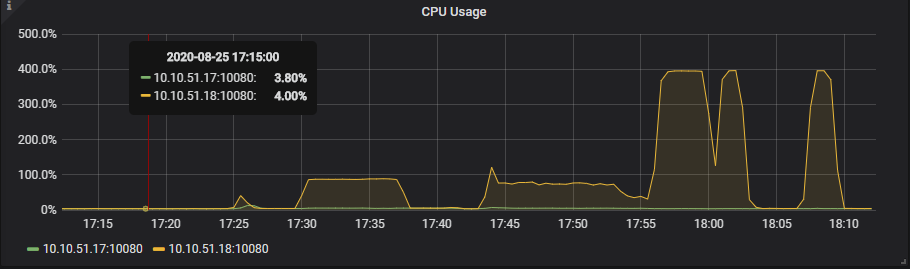
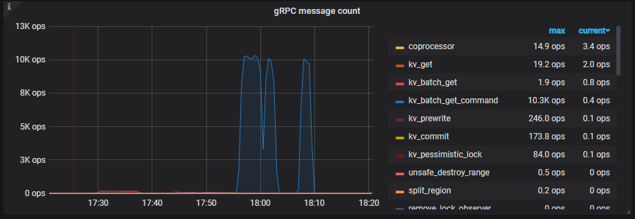
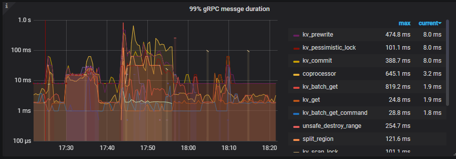
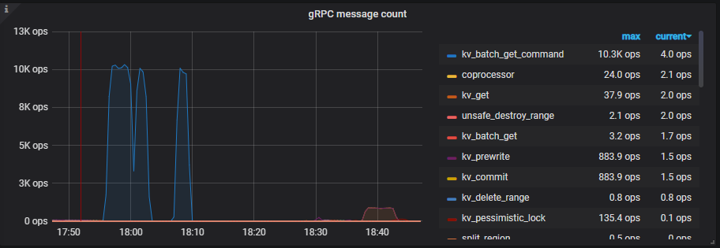

# Lesson 02

## 拓扑


| 地址        | CPU             | 内存 | 存储     | 网络 | 组件                       |
| ----------- | --------------- | ---- | -------- | ---- | -------------------------- |
| 10.10.51.16 | 8核(E5 2678 v3) | 32G  | 150G SSD | 1G   | PD+TiKV+Prometheus+Grafana |
| 10.10.51.17 | 8核(E5 2678 v3) | 32G  | 150G SSD | 1G   | PD+TiKV+TiDB               |
| 10.10.51.18 | 8核(E5 2678 v3) | 32G  | 150G SSD | 1G   | PD+TiKV+TiDB               |

## 配置

```yaml
global:
  user: "tidb"
  ssh_port: 22
  deploy_dir: "/tidb/deploy"
  data_dir: "/tidb/data"

monitored:
  node_exporter_port: 9100
  blackbox_exporter_port: 9115

server_configs:
  tidb:
    # 关闭慢日志
    log.enable-slow-log: false
    # 修改最大 CPU 使用数量为 4
    performance.max-procs: 4
    # 启用下推缓存
    tikv-client.copr-cache.enable: true
    tikv-client.copr-cache.capacity-mb: 4000.0
  tikv:
    # GRPC 线程池数量 2
    server.grpc-concurrency: 2
    # 减小 RocksDB 后台线程数为 4
    rocksdb.max-background-jobs: 4
    raftdb.max-background-jobs: 4
  pd:
    schedule.leader-schedule-limit: 4
    schedule.region-schedule-limit: 2048
    schedule.replica-schedule-limit: 64

pd_servers:
  - host: 10.10.51.16
  - host: 10.10.51.17
  - host: 10.10.51.18

tidb_servers:
  - host: 10.10.51.17
  - host: 10.10.51.18

tikv_servers:
  - host: 10.10.51.16
  - host: 10.10.51.17
  - host: 10.10.51.18

monitoring_servers:
  - host: 10.10.51.16

grafana_servers:
  - host: 10.10.51.16
```

## 部署

```bash
# 安装 TiUP
curl --proto '=https' --tlsv1.2 -sSf https://tiup-mirrors.pingcap.com/install.sh | sh

# 部署集群
tiup cluster deploy tidb-benchmark v4.0.4 ./tidb-benchmark.yaml --user root -p

# 启动集群
tiup cluster start tidb-benchmark
```

## sysbench

**安装**

```bash
# 安装
curl -s https://packagecloud.io/install/repositories/akopytov/sysbench/script.rpm.sh | sudo bash
sudo yum -y install sysbench
```

**编辑 sysbench 配置文件**

```
mysql-host=10.10.51.18
mysql-port=4000
mysql-user=root
mysql-password=
mysql-db=sysbench
time=300
threads=4
report-interval=10
db-driver=mysql
```

### 测试 oltp_point_select

```bash
# 准备测试数据
sysbench oltp_point_select --config-file=config --threads=8 --tables=32 --table_size=100000 prepare
# 执行测试
sysbench oltp_point_select --config-file=config --threads=32 --tables=32 --table_size=100000 run
# 清理
sysbench oltp_point_select --config-file=config --threads=8 --tables=32 --table_size=100000 cleanup
```

**测试结果**

sysbench 输出


TiDB-Summary-Query_Summary-Duration


TiDB-Summary-Query_Summary-QPS


TiDB-Summary-Server-CPU-Usage



TiKV-Details-Cluster-CPU


TiKV-Details-Cluster-QPS


TiKV-Details-gRPC-Message_Count



TiKV-Details-gRPC-Message_Duration



**分析**

点查测试根据 Grafana 报告数据，性能瓶颈在 TiDB 的 CPU。测试期间 TiDB 实例的 CPU 使用达到配置的上限 400%。

### 测试 oltp_insert

```bash
# 准备测试数据
sysbench oltp_insert --config-file=config --threads=8 --tables=16 --table_size=10000 prepare
# 执行测试
sysbench oltp_insert --config-file=config --threads=32 --tables=16 --table_size=10000 run
# 清理
sysbench oltp_insert --config-file=config --threads=8 --tables=16 --table_size=10000 cleanup
```

**测试结果**

sysbench 输出


TiDB-Summary-Query_Summary-Duration


TiDB-Summary-Query_Summary-QPS


TiDB-Summary-Server-CPU-Usage


TiKV-Details-Cluster-CPU


TiKV-Details-Cluster-IO


TiKV-Details-Cluster-QPS


TiKV-Details-gRPC-Message_Count



TiKV-Details-gRPC-Message_Duration


**分析**

插入测试根据 Grafana 报告数据，性能瓶颈在 TiKV 的 Raft IO。测试期间 TiKV 实例的 IO 负载均达到 80%。

## go-yscb

**安装**

```bash
git clone https://github.com/pingcap/go-ycsb.git
cd go-ycsb
make
```

### 测试

```bash
# 准备测试数据
./bin/go-ycsb load mysql -P workloads/workloadb -p recordcount=10000 -p mysql.host=10.10.51.18 -p mysql.port=4000 -p mysql.db=ycsb --threads 8
# 执行测试
./bin/go-ycsb run mysql -P workloads/workloadb -p operationcount=1000000 -p mysql.host=10.10.51.18 -p mysql.port=4000 -p mysql.db=ycsb --threads 32
```

**测试结果**

go-ycsb 输出


TiDB-Summary-Query_Summary-Duration


TiDB-Summary-Query_Summary-QPS


TiDB-Summary-Server-CPU-Usage


TiKV-Details-Cluster-CPU


TiKV-Details-Cluster-IO


TiKV-Details-Cluster-QPS


TiKV-Details-gRPC-Message_Count


TiKV-Details-gRPC-Message_Duration


**分析**

workloadb 测试结合 Grafana 报告的数据与 Dashboard 的高级调试得到的火焰图。
可以猜测读瓶颈在 TiDB 的 CPU 性能： Grafana 报告 TiDB CPU 负载达到限制的最高额度 400%，
而通过 profiling 可以看到，大量 CPU 时间花费在 TCP 连接读写，最终落在 fd 的 syscall 调用。
而 TiKV 的瓶颈主要还是在 raft 的 IO 上： Grafana 报告 TiKV 的 IO 利用率均达到 80% 以上，
通过 profiling 看出负载在 leader 节点的 IO 同步中。

## go-tpc

**安装**

```bash
curl --proto '=https' --tlsv1.2 -sSf https://raw.githubusercontent.com/pingcap/go-tpc/master/install.sh | sh
```

### 测试

```bash
# 准备测试数据
go-tpc tpcc -D tpc -H 10.10.51.18 -U root -P 4000 --warehouses 8 -T 8 prepare
# 执行测试
go-tpc tpcc -D tpc -H 10.10.51.18 -U root -P 4000 --warehouses 8 -T 32 --time 5m run
# 清理
go-tpc tpcc -D tpc -H 10.10.51.18 -U root -P 4000 --warehouses 8 -T 8 cleanup
```

**测试结果**

go-tpc 输出


TiDB-Summary-Query_Summary-Duration


TiDB-Summary-Query_Summary-QPS


TiDB-Summary-Server-CPU-Usage


TiKV-Details-Cluster-CPU


TiKV-Details-Cluster-IO


TiKV-Details-Cluster-QPS


TiKV-Details-gRPC-Message_Count


TiKV-Details-gRPC-Message_Duration


**测试结果(关闭同步写)**

go-tpc 输出


TiDB-Summary-Query_Summary-Duration


TiDB-Summary-Query_Summary-QPS


TiDB-Summary-Server-CPU-Usage


TiKV-Details-Cluster-CPU


TiKV-Details-Cluster-IO


TiKV-Details-Cluster-QPS


TiKV-Details-gRPC-Message_Count


TiKV-Details-gRPC-Message_Duration


**分析**

tpcc 测试通过 Grafana 报告数据、profiling 报告数据和异步写的测试结果对比，可以得到结论：
查询请求的瓶颈在 TiDB 的 CPU 性能限制；写请求的瓶颈在 TiKV 的硬盘 IO 限制。
通过对比同步写和异步写的 TiDB Profiling 结果，可以看出 TiDB 在异步写时，由于增加了请求的 QPS，
有更多的 CPU 被用于 GC，网络操作的 syscall 的占比下降。

## 结论

根据三个测试的分析结果，此硬件配置的查询瓶颈在 TiDB 的网络操作的 syscall，其次消耗在 GC 的内存分配和扫描。SQL 语句的处理消耗的 CPU 比较平均，没有显著的热点函数；
写操作则主要瓶颈在于 TiKV 的硬盘 IO，有大量的时间在等待 IO 同步写完成，导致写操作的 QPS 较低，从关闭同步写的测试结果中，Update 操作的 QPS 明显提升也可印证。
